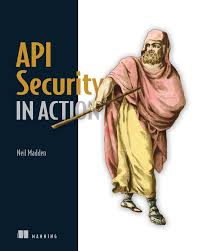

### Learning - API Security in Action

> Build with Java 11 SE - OpenJDK on Ubuntu 22.04

- This is my implementation for sample code in the book "API Security In Action", also for self-learning and reviewing my knowledge. 

Topics Covered:
1. Basic Authentication
2. Drool Access Manager
3. Token Based Authentication
4. HTTP Request Policy